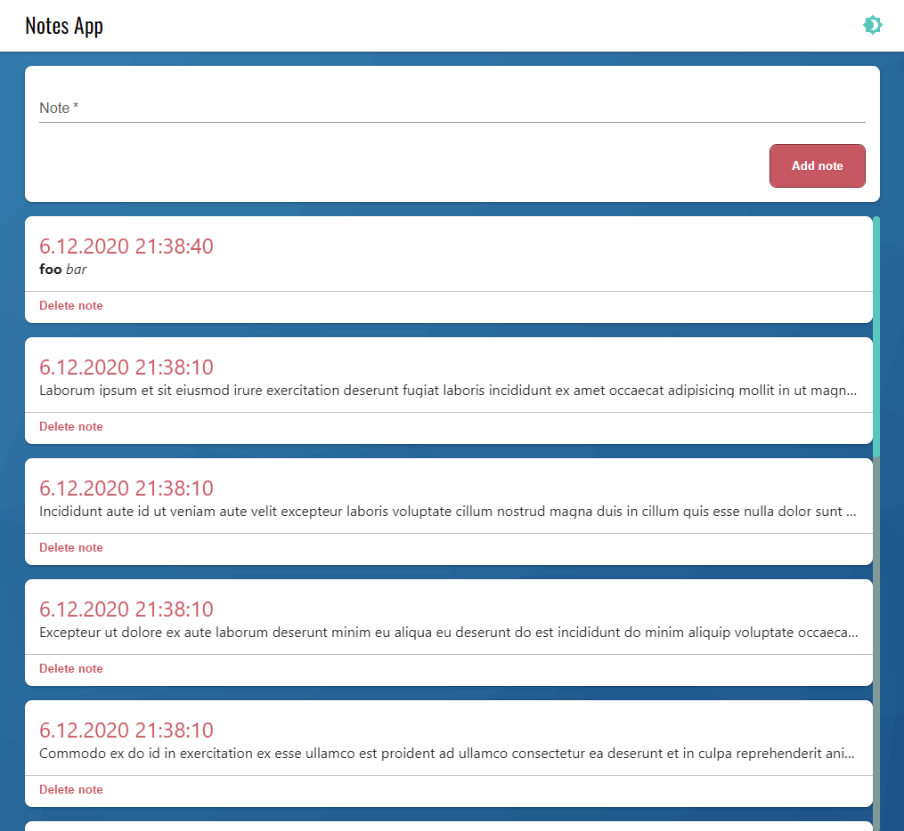

# Fullstack Recruitment Task  <!-- omit in toc -->
List of notes.



## Table of Contents <!-- omit in toc -->
- [Getting Started](#getting-started)
  - [Install Dependencies](#install-dependencies)
  - [Install Node Modules](#install-node-modules)
  - [Run application](#run-application)
- [Main (Technical) Features](#main-technical-features)

---

## Getting Started 
### Install Dependencies
- Node.js
- Redis Server

### Install Node Modules
```sh
client> npm i
server> npm i
```

### Run application
1. Start Redis Server
2. Start Apollo Server
    ```sh
    server> npm run dev # or npm start
    ```
3. Run App
    ```sh
    client> npm run dev
    ```

## Main (Technical) Features
- windowing
- Redis usage
- typed action dispatcher
- many more...